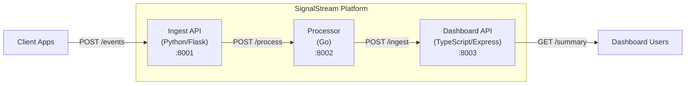

# SignalStream

Real-time event aggregation and analytics platform built with a microservice architecture using Python, Go, and TypeScript.

## Architecture



## Services

| Service | Language | Port | Description |
|---------|----------|------|-------------|
| **ingest-api** | Python (Flask) | 8001 | Receives and stores raw events |
| **processor** | Go | 8002 | Aggregates events by type and computes metrics |
| **dashboard-api** | TypeScript (Express) | 8003 | Serves analytics summaries for dashboards |

## Quick Start

### Prerequisites

- Docker and Docker Compose
- (For local dev) Python 3.12+, Go 1.22+, Node.js 22+

### Run with Docker Compose

```bash
cp .env.example .env
make up
```

All services will start on their respective ports. Verify with:

```bash
curl http://localhost:8001/health
curl http://localhost:8002/health
curl http://localhost:8003/health
```

### Stop Services

```bash
make down
```

## API Reference

### Ingest API (`:8001`)

| Method | Endpoint | Description |
|--------|----------|-------------|
| GET | `/health` | Health check |
| POST | `/events` | Ingest a new event |
| GET | `/events` | List events (query: `type`, `source`, `limit`) |
| DELETE | `/events` | Clear all events |

**POST /events** example:
```json
{
  "type": "click",
  "payload": { "page": "/home", "x": 120, "y": 450 },
  "source": "web"
}
```

### Processor (`:8002`)

| Method | Endpoint | Description |
|--------|----------|-------------|
| GET | `/health` | Health check |
| POST | `/process` | Process a batch of events |
| GET | `/metrics` | Get aggregated metrics |
| POST | `/metrics/reset` | Reset all metrics |

**POST /process** example:
```json
{
  "events": [
    { "id": "abc", "type": "click", "source": "web", "payload": {}, "ingested_at": 1700000000 }
  ]
}
```

### Dashboard API (`:8003`)

| Method | Endpoint | Description |
|--------|----------|-------------|
| GET | `/health` | Health check |
| POST | `/ingest` | Ingest events into dashboard summary |
| GET | `/summary` | Get dashboard summary |
| POST | `/summary/reset` | Reset dashboard summary |

**GET /summary** response:
```json
{
  "totalEvents": 150,
  "byType": { "click": 100, "view": 50 },
  "bySource": { "web": 120, "mobile": 30 },
  "lastUpdated": 1700000000000
}
```

## Development

### Run Tests

```bash
make test
```

Or individually:

```bash
make test-python
make test-go
make test-ts
```

### Linting

```bash
make lint
```

## Environment Variables

| Variable | Default | Description |
|----------|---------|-------------|
| `INGEST_PORT` | `8001` | Ingest API port |
| `PROCESSOR_PORT` | `8002` | Processor port |
| `DASHBOARD_PORT` | `8003` | Dashboard API port |
| `LOG_LEVEL` | `INFO` | Log level for Python service |

## CI/CD

GitHub Actions workflow is defined in `.github/workflows/ci.yml`. It runs:

1. Python tests and linting (flake8)
2. Go tests and vet
3. TypeScript tests and linting (ESLint)
4. Docker Compose build verification

> **Note:** The `.github/workflows/ci.yml` file may need to be added manually after the initial merge due to GitHub API restrictions on the `.github/` directory.

<details>
<summary>CI Workflow Content</summary>

```yaml
name: CI

on:
  push:
    branches: [main]
  pull_request:
    branches: [main]

jobs:
  test-python:
    runs-on: ubuntu-latest
    defaults:
      run:
        working-directory: services/ingest-api
    steps:
      - uses: actions/checkout@v4
      - uses: actions/setup-python@v5
        with:
          python-version: "3.12"
      - run: pip install -r requirements.txt
      - run: flake8 --max-line-length=120 app.py
      - run: pytest -v

  test-go:
    runs-on: ubuntu-latest
    defaults:
      run:
        working-directory: services/processor
    steps:
      - uses: actions/checkout@v4
      - uses: actions/setup-go@v5
        with:
          go-version: "1.22"
      - run: go vet ./...
      - run: go test -v ./...

  test-typescript:
    runs-on: ubuntu-latest
    defaults:
      run:
        working-directory: services/dashboard-api
    steps:
      - uses: actions/checkout@v4
      - uses: actions/setup-node@v4
        with:
          node-version: "22"
      - run: npm install
      - run: npx eslint src/ --ext .ts
      - run: npm test

  docker-build:
    runs-on: ubuntu-latest
    needs: [test-python, test-go, test-typescript]
    steps:
      - uses: actions/checkout@v4
      - run: docker compose build
```

</details>

## License

MIT
